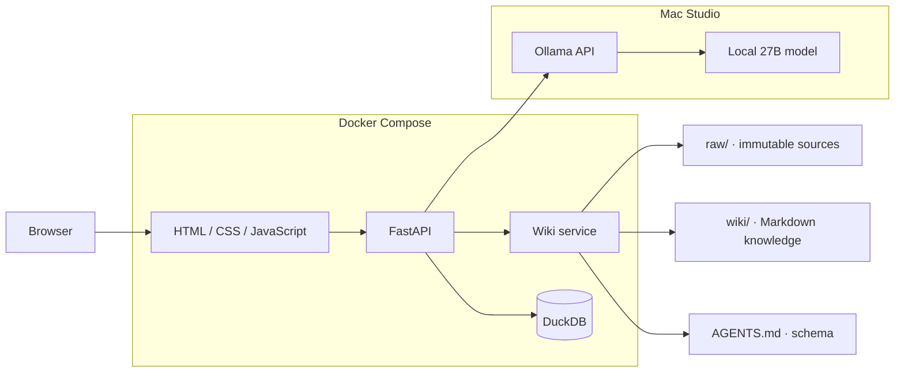

# local-llm-wiki

在 Mac Studio 上，用本地 27B 大模型构建一个会持续生长的个人知识库。

`local-llm-wiki` 是 [Andrej Karpathy 的 LLM Wiki 构想](https://gist.github.com/karpathy/442a6bf555914893e9891c11519de94f)的本地化实现：系统不只在提问时临时检索原始文档，而是让 LLM 持续阅读新资料、整理概念、维护交叉引用，并将结果沉淀为可读、可编辑、可版本控制的 Markdown Wiki。

> [!IMPORTANT]
> 项目目前处于设计与初始化阶段。本 README 描述的是目标架构和计划接口，代码与启动配置尚未提交。

## 核心理念

传统 RAG 通常在每次提问时重新检索和拼接文档片段；LLM Wiki 则把已经完成的归纳、关联和冲突检查保存在一个持续演化的知识层中。

- **Raw sources**：用户提供的原始资料，只读保存，作为事实来源。
- **Wiki**：由 LLM 创建和维护的 Markdown 页面，包括主题、实体、摘要、引用和交叉链接。
- **Schema**：约束 LLM 如何摄取、查询和维护 Wiki 的规则文件。

人的工作是选择资料、提出问题和校验结果；模型负责归纳、归档、链接与日常维护。

## 目标

- 完整运行在本地，资料和推理请求默认不离开设备。
- 通过 Ollama 调用 Mac Studio 上的 27B 模型。
- 将 PDF、Markdown、文本等资料摄取为结构化 Wiki。
- 根据新增资料增量更新已有页面，而不是重复生成孤立摘要。
- 回答问题时给出可追溯的 Wiki 页面和原始来源。
- 检查矛盾、过期内容、孤立页面和缺失链接。
- 使用轻量的原生 Web 界面浏览、摄取和查询知识库。
- 使用 Docker Compose 统一管理应用服务。

## 系统架构



### 技术选型

| 层级 | 技术 | 职责 |
| --- | --- | --- |
| 前端 | HTML / CSS / JavaScript | 资料上传、任务状态、Wiki 浏览与问答 |
| 后端 | FastAPI | API、摄取编排、查询和维护任务 |
| 模型服务 | Ollama | 在本地运行可配置的 27B 模型 |
| 知识载体 | Markdown | 保存长期演化、可审阅和可迁移的 Wiki |
| 状态存储 | DuckDB | 保存来源元数据、文件哈希、任务状态和审计记录 |
| 运行环境 | Docker Compose | 管理应用容器、挂载数据目录和环境变量 |

Markdown 是知识库的主要产物；DuckDB 只负责应用状态和结构化元数据，避免将 Wiki 锁定在某个数据库中。

> [!NOTE]
> 在 macOS 上，Ollama 原生运行可以直接利用 Metal。应用容器计划通过 `host.docker.internal:11434` 访问 Ollama，而不是在 Docker Desktop 中运行模型。

## 工作流程

### 1. Ingest — 摄取

1. 将资料保存到 `workspace/raw/`，计算哈希并登记到 DuckDB。
2. 本地模型提取关键信息，生成或更新 `workspace/wiki/` 中的页面。
3. 更新主题、实体、交叉引用和来源关系。
4. 更新 `index.md`，并向 `log.md` 追加本次操作记录。

原始资料一经摄取便保持只读；模型只能修改 Wiki 层。

### 2. Query — 查询

1. 先读取 Wiki 索引，定位相关页面。
2. 基于已积累的知识进行回答，必要时回溯原始资料。
3. 返回页面级引用；有长期价值的分析可在用户确认后写回 Wiki。

### 3. Lint — 维护

定期检查以下问题：

- 相互矛盾或已被新资料取代的结论；
- 没有入链的孤立页面；
- 被频繁提及但尚无独立页面的概念；
- 缺失来源或交叉引用的陈述；
- 长期未更新、需要重新核验的内容。

## 计划中的目录结构

```text
local-llm-wiki/
├── backend/                 # FastAPI 应用
├── frontend/                # 原生 Web 界面
├── workspace/
│   ├── raw/                 # 只读原始资料
│   ├── wiki/
│   │   ├── index.md         # Wiki 内容索引
│   │   └── log.md           # 追加式操作日志
│   └── AGENTS.md            # Wiki 结构与维护规则
├── data/                    # DuckDB 数据文件
├── tests/
├── .env.example
├── Dockerfile
└── docker-compose.yml
```

## 计划中的 API

| 方法 | 路径 | 用途 |
| --- | --- | --- |
| `POST` | `/api/sources` | 上传并登记原始资料 |
| `POST` | `/api/ingest` | 启动 Wiki 摄取任务 |
| `POST` | `/api/query` | 查询知识库 |
| `POST` | `/api/lint` | 检查 Wiki 健康状态 |
| `GET` | `/api/wiki` | 获取 Wiki 页面列表 |
| `GET` | `/api/wiki/{path}` | 读取指定 Wiki 页面 |
| `GET` | `/api/health` | 检查应用与 Ollama 状态 |

## 预期启动方式

以下命令代表项目完成首个可运行版本后的目标体验，目前尚不可用。

### 环境要求

- macOS 与 Apple Silicon Mac（目标设备为 Mac Studio）
- [Docker Desktop](https://www.docker.com/products/docker-desktop/)
- [Ollama](https://ollama.com/)
- 足以运行所选 27B 模型的统一内存和磁盘空间

### 启动

```bash
git clone https://github.com/Archangel-he/local-llm-wiki.git
cd local-llm-wiki

ollama list
cp .env.example .env
# 在 .env 中将 OLLAMA_MODEL 设置为本机已安装的 27B 模型标签

docker compose up --build
```

启动后计划访问：

- Web：<http://localhost:8000>
- API 文档：<http://localhost:8000/docs>
- 健康检查：<http://localhost:8000/api/health>

计划中的关键环境变量：

```dotenv
OLLAMA_BASE_URL=http://host.docker.internal:11434
OLLAMA_MODEL=<your-local-27b-model>
WORKSPACE_PATH=/app/workspace
DUCKDB_PATH=/app/data/wiki.duckdb
```

## MVP 验收标准

- 上传一个受支持的文档后，原文件保存在 `workspace/raw/` 且不会被模型修改。
- 摄取任务能生成摘要页，并同步更新 `wiki/index.md` 与 `wiki/log.md`。
- 第二份相关资料能够更新已有主题页，并保留来源关系。
- 查询结果能引用具体 Wiki 页面，必要时可追溯到原始资料。
- Lint 能报告至少三类结构问题：孤立页面、缺失来源和断开的 Wiki 链接。
- 重启容器后，Wiki 文件和 DuckDB 状态仍然存在。

## 路线图

- [ ] 初始化 FastAPI、静态前端与 Docker Compose
- [ ] 接入 Ollama 流式生成接口
- [ ] 建立 Raw / Wiki / Schema 三层工作区
- [ ] 实现文档摄取、索引与操作日志
- [ ] 实现带引用的知识库问答
- [ ] 实现 Wiki lint 与维护任务
- [ ] 增加任务状态、失败重试和基础测试
- [ ] 针对 Mac Studio 上的 27B 模型进行性能测试

## 设计原则

- **Local first**：默认不依赖云端模型或托管数据库。
- **Source first**：原始资料不可变，生成内容必须能够回溯来源。
- **Markdown first**：知识可直接阅读、编辑、迁移和使用 Git 管理。
- **Incremental**：新增资料应更新既有知识结构，而不是制造重复页面。
- **Inspectable**：模型的写入、引用和维护动作都应留下记录。
- **Simple first**：在 Wiki 规模确实需要之前，不引入向量数据库等额外基础设施。

## 致谢

本项目源于 Andrej Karpathy 提出的 [LLM Wiki](https://gist.github.com/karpathy/442a6bf555914893e9891c11519de94f) 模式。原始构想强调三层结构：不可变的原始资料、由 LLM 维护的 Markdown Wiki，以及约束维护流程的 Schema。

## License

暂未指定开源许可证。在许可证提交前，仓库内容默认保留全部权利。
