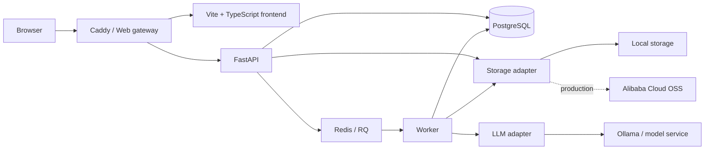

# local-llm-wiki

从 localhost 起步，构建一个可部署、可协作、持续生长的 LLM Wiki。

`local-llm-wiki` 是 [Andrej Karpathy 的 LLM Wiki 构想](https://gist.github.com/karpathy/442a6bf555914893e9891c11519de94f)的工程化实现：系统不只在提问时临时检索原始文档，而是让 LLM 持续阅读新资料、整理概念、维护交叉引用，并将结果沉淀为可读、可追溯、可持续演化的 Markdown Wiki。

项目首先在 Mac Studio 上通过 Ollama 和本地 27B 模型完成闭环验证，之后部署到阿里云服务器，并逐步支持多用户与团队协作。

> [!IMPORTANT]
> 项目目前处于设计与初始化阶段。本文是项目入口；具体架构、流程、接口、测试和部署规范位于 [`docs/`](docs/)。

## 核心闭环

```text
添加原始资料
→ 保存不可变来源
→ LLM 生成或更新 Wiki
→ 建立链接、引用和关系图谱
→ 用户阅读、提问和校验
→ 有价值的结论经确认后写回 Wiki
→ Lint 持续发现冲突、断链和知识缺口
```

传统 RAG 在每次提问时重新检索和拼接文档；LLM Wiki 则将已经完成的归纳、关联和冲突检查保存在一个持续演化的知识层中。

- **Raw sources**：不可变的原始资料，是事实来源。
- **Wiki**：由 LLM 维护、由用户阅读和校验的 Markdown 知识层。
- **Schema**：约束摄取、引用、链接、查询和维护的规则。

## 实施策略

项目从零开始，因此采用：

> **单用户产品体验，多用户数据基础。**

MVP 0～2 自动进入默认用户和默认知识空间，优先验证“资料 → Wiki → 图谱 → 问答 → 维护”；但数据库、API、文件路径和任务从第一天就包含 `user_id` 与 `workspace_id`。MVP 3 再启用注册和多用户隔离，MVP 4 增加团队协作。

关键边界：

- PostgreSQL 是在线业务和 Wiki Markdown 正文/版本的权威数据库；
- Raw 文件保存在本地存储或 OSS，上传后字节内容不可修改；
- Wiki 可导出为 Obsidian-compatible Markdown Vault；
- 页面支持 `[[wikilink]]`、aliases、Source Summary，以及可生成的 Index/Overview/Activity；
- Redis + RQ 执行摄取、查询和 Lint 等后台任务；
- MVP 2 使用 PostgreSQL FTS + `pg_trgm` 多语言回退，不提前引入向量数据库；
- 模型只能返回结构化变更计划，不能直接写数据库或文件；
- REST 处理命令和状态，SSE 处理流式回答与任务进度。

这些决策及其权衡记录在 [`docs/decisions/`](docs/decisions/)。

## 系统架构



| 层级 | 技术 | 职责 |
| --- | --- | --- |
| 前端 | Vite + TypeScript + Sigma.js | 文件管理、关系图谱、问答和 Wiki 阅读 |
| 网关 | Caddy | 静态资源、API 反向代理和生产 HTTPS |
| API | FastAPI | 用户、空间、权限、命令和 SSE |
| 数据库 | PostgreSQL | 用户、任务、Wiki Markdown、版本、链接和审计 |
| 队列 | Redis + RQ | 异步任务、重试、超时和并发控制 |
| 模型 | Ollama / LLM adapter | 本地或服务器端模型推理 |
| 文件 | Local storage / OSS | 不可变来源、附件和导出文件 |
| 部署 | Docker Compose | localhost 与单机服务器部署 |

完整设计见 [`docs/architecture.md`](docs/architecture.md)。

## 前端工作区

顶部区域暂时只预留；桌面工作区采用类似 Obsidian 的布局：

```text
┌──────────────────────────────────────────────────────────────────────┐
│                              顶部区域（待定）                         │
├──────────────┬─────────────────────────────┬─────────────────────────┤
│ 文件管理      │ 关系图谱                     │ Wiki 条目                │
│              │                             │                         │
│ ▾ Raw        │ [全局图] [局部图] [筛选]     │ Markdown 正文             │
│ ▾ Wiki       │                             │ 来源与引用                 │
│ ▾ Lint       ├─────────────────────────────┤ 双向链接                   │
│ ▾ Recent     │ 问答区                       │ 版本记录                   │
│              │ [当前条目][局部图][全空间]   │                         │
└──────────────┴─────────────────────────────┴─────────────────────────┘
```

MVP 0 只完成可拖动的线框和 Mock 数据；文件树、图谱、问答和 Wiki 在后续 MVP 中逐步接入。视觉主题、动画、移动端和高级聚类延后。

完整交互见 [`docs/frontend.md`](docs/frontend.md)。

## 路线图

| 阶段 | 可验证闭环 | 退出条件 |
| --- | --- | --- |
| MVP 0 | 一条命令启动全部基础服务和前端骨架 | 健康检查、迁移、持久化、Mock UI 全部通过 |
| MVP 1 | Markdown/TXT → Source Summary → Wiki/aliases → Index → 图谱 | 来源不可变、页面不重复、Index/Activity 与兼容导出可用 |
| MVP 2 | Batch/PDF → 增量综合 → 检索 → 问答 → 引用 → Lint | 已知可回答、未知会拒答、冲突和 Schema 变化可审查 |
| MVP 3 | 两个用户和多个知识空间 | 跨空间访问全部被拒绝，并发任务不串数据 |
| MVP 4 | Owner 邀请 Editor/Viewer 协作 | 权限矩阵、版本和并发冲突测试通过 |
| MVP 5 | localhost 环境部署到阿里云 | HTTPS、备份恢复、生产 E2E 和监控通过 |

详细范围、依赖、分工和验收命令见 [`docs/roadmap.md`](docs/roadmap.md)。

## 四人分工

成员不绑定固定账号，按 A、B、C、D 四个角色协作，可根据实际专长交换角色。

| 角色 | 主要职责 |
| --- | --- |
| A：架构与集成 | Docker、CI、接口契约、版本验收和云端部署 |
| B：后端与数据 | FastAPI、PostgreSQL、数据模型、认证和权限 |
| C：LLM 与 Wiki | Ollama、RQ Worker、Ingest、Query、Schema 和 Lint |
| D：前端与测试 | 三栏工作区、关系图谱、问答联动、E2E 和用户文档 |

协作规则：

- 每个 MVP 建立一个 GitHub Milestone；
- 每个阶段拆成 A、B、C、D 四个主 Issue；
- API 与数据结构先确定，前端使用 Mock API 并行开发；
- 使用短生命周期分支和 Pull Request；
- `main` 始终保持可启动和测试通过；
- 前一阶段验收未通过，不进入下一阶段。

## 目标启动方式

以下命令代表完成 MVP 0 后的目标体验，目前尚不可用。

```bash
git clone https://github.com/Archangel-he/local-llm-wiki.git
cd local-llm-wiki

cp .env.example .env
docker compose up --build
```

计划访问地址：

- Web：<http://localhost:8000>
- API：<http://localhost:8000/api>
- API 文档：<http://localhost:8000/api/docs>
- 健康检查：<http://localhost:8000/api/health>

在 macOS 上，Ollama 默认原生运行以使用 Metal；容器通过 `host.docker.internal:11434` 访问模型。阿里云部署时通过 `LLM_BASE_URL` 切换为同机或独立模型服务。

## 文档索引

| 文档 | 内容 |
| --- | --- |
| [`docs/roadmap.md`](docs/roadmap.md) | MVP 0～5、依赖、闭环、分工和退出条件 |
| [`docs/workflows.md`](docs/workflows.md) | 摄取、查询、写回、Lint、协作、导出和故障恢复流程 |
| [`docs/karpathy-reference.md`](docs/karpathy-reference.md) | Karpathy/Obsidian 参考映射、吸收内容和兼容边界 |
| [`docs/architecture.md`](docs/architecture.md) | 系统上下文、组件、数据流和部署拓扑 |
| [`docs/data-model.md`](docs/data-model.md) | 权威数据、表结构、事务、状态和删除语义 |
| [`docs/wiki-schema.md`](docs/wiki-schema.md) | 页面格式、LLM 变更协议、引用、冲突和 Lint |
| [`docs/api-contract.md`](docs/api-contract.md) | REST、SSE、错误格式、图谱和权限约定 |
| [`docs/frontend.md`](docs/frontend.md) | 三栏布局、图谱、面板联动和开发节奏 |
| [`docs/testing.md`](docs/testing.md) | 固定数据集、自动测试、真实模型和性能门槛 |
| [`docs/deployment.md`](docs/deployment.md) | localhost、阿里云、HTTPS、备份恢复和运维 |
| [`docs/decisions/`](docs/decisions/) | 关键架构决策与替代方案 |

## 设计原则

- **Core first**：先验证摄取、Wiki、图谱、问答和维护闭环。
- **Multi-tenant ready**：界面可以先单用户，数据不能是全局单用户。
- **Source first**：原始资料不可变，生成内容必须回溯来源。
- **Markdown first**：Wiki 内容始终是 Markdown，并可导出为普通文件。
- **Obsidian compatible**：保留 Frontmatter、aliases 和 `[[wikilink]]`，但不依赖 Obsidian 运行。
- **Schema evolves with review**：模型可以建议 Schema，不能自行启用新规则。
- **Incremental**：新增资料更新既有知识，而不是制造重复页面。
- **Local first, cloud ready**：本地与云端使用相同接口和配置。
- **Inspectable**：模型、权限、引用和维护动作都留下记录。
- **Simple first**：需求未证明前不引入向量数据库、Neo4j 或集群编排。

## 致谢

本项目源于 Andrej Karpathy 提出的 [LLM Wiki](https://gist.github.com/karpathy/442a6bf555914893e9891c11519de94f) 模式，并参考 [green-dalii/obsidian-llm-wiki](https://github.com/green-dalii/obsidian-llm-wiki) 的产品实践；参考项目不是本项目的运行时依赖。

## License

暂未指定开源许可证。应在 MVP 0 结束前完成许可证决策；在此之前，仓库内容默认保留全部权利。
