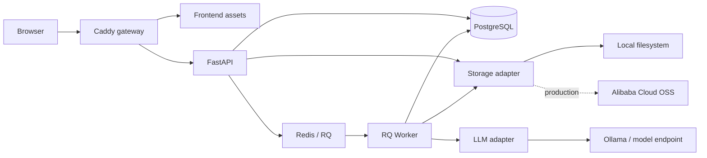
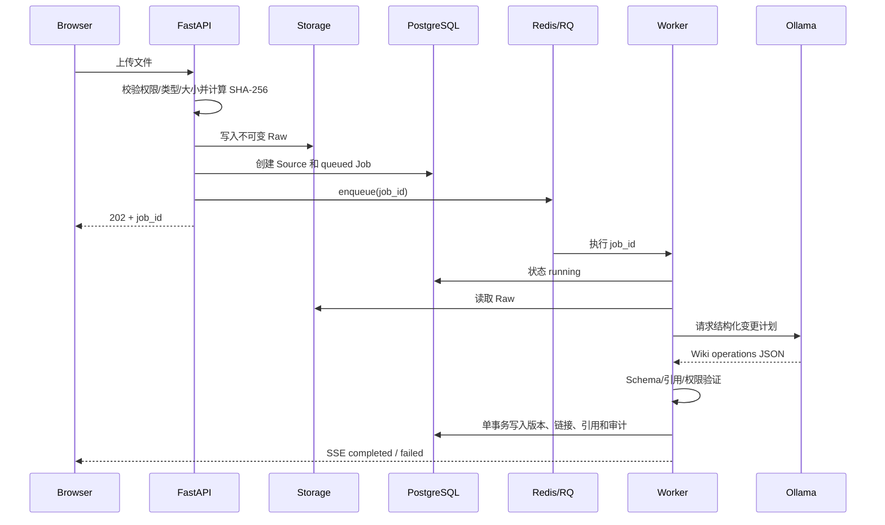
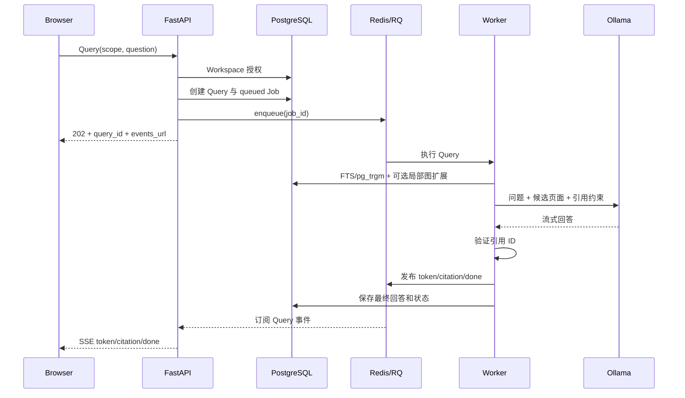

# 系统架构

## 目标与边界

系统必须同时满足：

- localhost 上一条命令启动；
- Mac Studio 上使用原生 Ollama 和 Metal；
- 从第一天按用户和知识空间隔离数据；
- 后续可以迁移到老师的阿里云服务器；
- Raw 来源不可变，Wiki 可追溯、可版本化、可导出；
- 长时间模型任务不阻塞 Web 请求；
- 早期保持单机简单性，不引入 Kubernetes、Neo4j 和向量数据库。

非目标：

- MVP 阶段不支持离线浏览器应用；
- 不让浏览器直接连接 PostgreSQL、Redis、OSS 或 Ollama；
- 不把模型生成内容当作无来源事实；
- 不在 MVP 阶段实现多区域和自动水平扩缩容。

## 组件图



## 组件职责

### Caddy

- 对外提供统一的 8000（本地）或 80/443（生产）入口；
- 提供构建后的前端静态资源；
- 将 `/api/*` 和 SSE 请求转发给 FastAPI；
- 在生产环境终止 TLS；
- 不承担业务认证，认证与授权仍由 FastAPI 完成。

### Frontend

- Vite + TypeScript；
- Sigma.js + Graphology 渲染图谱；
- 不持有数据库或 OSS 凭据；
- 所有业务数据通过 API 获取；
- Session Cookie 使用 `HttpOnly`，前端不能读取。

### FastAPI

- 输入验证、认证和 Workspace 授权；
- 创建 Source、Job、Query 和 Lint 命令；
- 返回 Wiki、文件树、图谱和审计数据；
- 通过 SSE 输出任务进度和模型流式回答；
- 不在请求进程中执行长时间模型推理。

### PostgreSQL

- 在线业务权威数据库；
- 保存用户、Workspace、成员、来源元数据和任务状态；
- 保存 Wiki Markdown 正文、版本、链接和引用；
- 保存审计日志和查询记录；
- 通过事务保证一批 Wiki 变更同时成功或回滚。

### Redis + RQ

- Redis 保存队列和短期任务运行信息；
- RQ Worker 执行 Ingest、Query、Lint、Export；
- PostgreSQL 中的 `jobs` 表保存用户可见的长期任务状态；
- Redis 不是业务事实来源，Redis 丢失后可根据 PostgreSQL 恢复未完成任务。

### Storage adapter

统一接口：

```text
put_immutable(stream, storage_key, sha256)
open(storage_key)
exists(storage_key)
archive(storage_key)
create_export(workspace_id)
```

实现：

- localhost：本地文件系统；
- 阿里云：OSS，或早期使用 ECS 数据盘；
- Raw 文件不允许覆盖；同一 `storage_key` 内容不同则拒绝写入。

### LLM adapter

```text
health()
generate_structured(schema, messages, options)
stream(messages, options)
```

- 第一实现为 Ollama；
- 业务层不依赖具体模型名称；
- 模型只返回结构化计划或文本流，不直接访问数据库；
- 所有模型调用记录模型、Prompt/Schema 版本、耗时和结果状态。

## 权威数据边界

```text
PostgreSQL
├── Wiki Markdown 正文和版本
├── 页面、链接、引用和冲突
├── 用户、空间、权限和任务
└── 审计记录

Local storage / OSS
├── Raw 原始文件
├── 图片和附件
└── 导出的 Obsidian Vault / ZIP

Redis
└── 可重建的队列运行状态
```

导出的 Markdown Vault 是可移植产物，不是在线权威数据。用户修改导出文件不会自动写回服务端；未来如实现 Import，必须作为新的显式流程处理。

## 主要流程

### 上传与摄取



### 查询



Redis 事件是实时通道，不是最终结果事实来源。SSE 断线后，客户端从 PostgreSQL 读取 Query 最终状态和已保存回答。有价值的回答不会自动写回 Wiki；用户选择“保存到 Wiki”后，系统创建独立的结构化更新任务。

## 本地拓扑

Docker Compose 服务：

```text
gateway
api
worker
postgres
redis
```

Ollama 默认运行在 macOS 宿主机：

```dotenv
LLM_BASE_URL=http://host.docker.internal:11434
```

## 阿里云拓扑

早期生产仍使用单台 ECS + Docker Compose：

```text
Internet
→ 80/443 Caddy
→ API / Worker
→ PostgreSQL / Redis（仅容器内网）
→ OSS 或挂载数据盘
→ 同机 Ollama 或私网模型服务
```

只有 80/443 对公网开放；22 只允许可信 IP。PostgreSQL、Redis、Ollama 和对象存储管理端口不得直接暴露公网。

## 扩展触发条件

在出现以下证据前不升级架构：

- 单机 PostgreSQL 已成为实际瓶颈；
- Worker 队列积压无法通过增加 Worker 解决；
- 本地/OSS 文件适配器无法满足吞吐；
- PostgreSQL FTS 的召回质量被固定评测证明不足；
- 图谱规模或查询需要专用图数据库。

满足条件后再评估 RDS、托管 Redis、向量检索、Neo4j 或容器编排平台。

## 相关文档

- [Karpathy / Obsidian 参考边界](karpathy-reference.md)
- [业务流程](workflows.md)
- [数据模型](data-model.md)
- [Wiki Schema](wiki-schema.md)
- [API 契约](api-contract.md)
- [部署设计](deployment.md)
