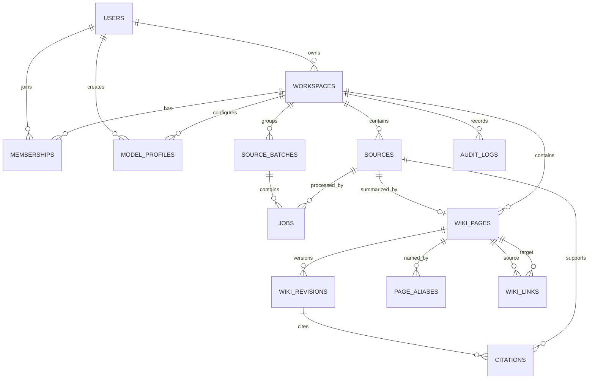

# 数据模型与一致性

## 权威数据

在线系统的权威数据分为两类：

1. PostgreSQL：结构化业务数据、Wiki Markdown 正文和历史版本。
2. Storage：不可变 Raw 文件、附件和导出文件。

Redis 只保存可重建的队列状态，不是长期事实来源。

## 通用约定

- 主键使用 UUID；
- 时间统一保存 UTC，API 使用 ISO 8601；
- Workspace 资源都包含 `workspace_id`；个人资源包含 `owner_user_id`；
- 所有唯一约束都包含对应的 Workspace 或 Owner 作用域；
- 业务删除默认是归档，不立即物理删除；
- Markdown 页面通过稳定 `page_id` 标识，改名不改变 ID；
- 数据库迁移只通过 Alembic 执行。

## 实体关系



## 核心表

### users

| 字段 | 说明 |
| --- | --- |
| `id` | UUID |
| `email` | 规范化后唯一 |
| `password_hash` | MVP 3 起使用 Argon2id |
| `display_name` | 展示名称 |
| `status` | `active / disabled` |
| `created_at` | 创建时间 |

MVP 0～2 自动创建 `default-user`，但仍使用真实的 User 记录。

### workspaces

| 字段 | 说明 |
| --- | --- |
| `id` | UUID |
| `owner_id` | 创建者 |
| `name` | 名称 |
| `slug` | 用户内唯一短名 |
| `status` | `active / archived` |
| `schema_version` | 当前 Wiki Schema 版本 |
| `default_model_profile_id` | 共享 Wiki 写入使用的 Workspace Profile，可为空 |
| `created_at` | 创建时间 |

`default_model_profile_id` 必须引用同一 Workspace 中 `scope=workspace` 且 `status=active` 的 Profile。

### memberships

复合唯一键：`(workspace_id, user_id)`。

角色：

```text
owner
editor
viewer
```

Owner 至少保留一名；最后一名 Owner 不能直接退出空间，必须先转移所有权或归档空间。

### model_profiles

| 字段 | 说明 |
| --- | --- |
| `id` | UUID |
| `scope` | `personal / workspace` |
| `owner_user_id` | personal Profile 所有者 |
| `workspace_id` | workspace Profile 所属空间 |
| `profile_key` | 作用域内稳定且唯一的机器标识，用于幂等初始化和任务记录 |
| `provider` | `mock / ollama / openai_compatible` |
| `display_name` | 用户可见名称 |
| `base_url` | 规范化后的服务地址 |
| `model_name` | Model ID |
| `credential_ciphertext` | 可为空的认证加密 API Key |
| `credential_key_version` | 加密主密钥版本 |
| `capabilities_json` | 连接测试得到的 streaming/structured 等能力 |
| `status` | `untested / active / invalid / revoked` |
| `last_tested_at` | 最近连接测试时间 |
| `created_by/created_at` | 创建人和时间 |

约束：personal 必须有 `owner_user_id` 且没有 `workspace_id`；workspace 必须有 `workspace_id` 且没有 `owner_user_id`。`profile_key` 在对应 Owner 或 Workspace 内唯一。Mock/Ollama Profile 可以没有 API Key。API Key 不可查询回显，只能替换或撤销。

`user_preferences.default_query_model_profile_id` 保存个人 Query 默认值，必须引用该用户有权使用且 active 的 Profile。Workspace 成员只能读取 workspace Profile 的脱敏信息；MVP 3 起只有 Owner 能创建、替换凭据或设为默认写入 Profile。

### sources

| 字段 | 说明 |
| --- | --- |
| `id` | UUID |
| `workspace_id` | 所属空间 |
| `sha256` | 原始字节哈希 |
| `original_filename` | 原文件名 |
| `safe_filename` | 规范化文件名 |
| `mime_type` | 检测后的类型 |
| `size_bytes` | 文件大小 |
| `storage_key` | Storage 内部路径 |
| `status` | `active / archived / rejected` |
| `created_by` | 上传者 |
| `created_at` | 上传时间 |

唯一约束：`(workspace_id, sha256)`。相同空间重复上传相同字节返回已有 Source，不重复写文件。

Raw 文件字节不可覆盖；归档 Source 只更新数据库状态，不修改原始字节。

### source_batches

MVP 2 用于多文件上传的聚合状态：

```text
id
workspace_id
created_by
total_count
queued_count
skipped_count
completed_count
failed_count
cancelled_count
created_at
finished_at
```

Batch 计数由关联 Job 状态确定性更新或重算，不承担 Wiki 提交事务。每个 Job 可以有可为空的 `batch_id`；一个 Job 失败不回滚其他 Job。

### jobs

任务类型：

```text
ingest
query
lint
wiki_update
schema_migration
export
```

任务状态：

```text
queued → running → completed
             └──→ retrying → running
             └──→ failed
queued → cancelled
running → cancel_requested → cancelled
```

运行中的取消是协作式的：API 只设置 `cancel_requested`，Worker 在安全检查点停止；数据库事务提交开始后不强制中断，避免留下半提交数据。`max_attempts = 3` 表示最多三次总尝试，即首次执行加两次重试。

字段至少包含：

```text
id
workspace_id
source_id nullable
batch_id nullable
model_profile_id nullable
model_snapshot_json nullable
job_type
status
idempotency_key
attempt
max_attempts
progress
error_code
error_message_safe
rq_job_id
created_by
created_at
started_at
heartbeat_at
finished_at
```

`error_message_safe` 可以返回前端；详细堆栈只进入服务端日志。

Ingest 幂等键：

```text
workspace_id
+ source_sha256
+ parser_version
+ schema_version
+ model_profile_id
+ model_name
```

`model_snapshot_json` 只保存 Provider、Model ID、经过脱敏的 Endpoint 标识和 adapter 版本，不保存 API Key。

相同幂等键已有 `queued/running/completed` 任务时，不再创建重复任务。

### wiki_pages

| 字段 | 说明 |
| --- | --- |
| `id` | 稳定 UUID |
| `workspace_id` | 所属空间 |
| `slug` | 空间内唯一，可修改 |
| `title` | 页面标题 |
| `page_type` | `topic/entity/source/analysis/question` |
| `primary_source_id` | 仅 Source Summary 使用，可为空 |
| `summary` | Index 使用的一句话摘要 |
| `status` | `active/needs_review/archived` |
| `current_revision_id` | 当前版本 |
| `created_at/updated_at` | 时间 |

唯一约束：`(workspace_id, slug)`。

当 `page_type = source` 时，`primary_source_id` 必填，并通过 `(workspace_id, primary_source_id)` 唯一约束确保每份 Raw Source 只有一个 Source Summary。

### page_aliases

| 字段 | 说明 |
| --- | --- |
| `workspace_id` | 所属空间 |
| `page_id` | 目标页面 |
| `alias_normalized` | 用于唯一约束和匹配的规范化别名 |
| `alias_display` | 用户可见写法 |
| `language` | 可为空的语言标记 |
| `created_by_revision_id` | 首次产生该别名的 Revision |

唯一约束：`(workspace_id, alias_normalized)`。写入前还必须检查 alias 是否与其他页面规范化后的 title/slug 冲突。标题、slug 和 aliases 共同参与新页面创建前的实体解析；命中 alias 只产生重复候选，不能在没有证据时自动合并页面。

### wiki_revisions

| 字段 | 说明 |
| --- | --- |
| `id` | UUID |
| `page_id` | 页面 |
| `revision_no` | 页面内递增整数 |
| `markdown` | 正文，不含导出 Frontmatter |
| `frontmatter_json` | 结构化元数据 |
| `change_summary` | 本次修改摘要 |
| `schema_version` | Schema 版本 |
| `model_name` | 生成模型，可为空 |
| `model_provider` | Provider 类型，可为空 |
| `model_profile_id` | 触发该 Revision 的 Profile，可为空 |
| `prompt_version` | Prompt 版本，可为空 |
| `job_id` | 触发任务，可为空 |
| `created_by` | 用户或 system |
| `created_at` | 时间 |

页面更新永不覆盖旧 revision。`current_revision_id` 指向当前公开版本。

### wiki_links

| 字段 | 说明 |
| --- | --- |
| `workspace_id` | 所属空间 |
| `source_page_id` | 起点 |
| `target_page_id` | 终点，可为空（断链） |
| `target_slug` | 原始目标 slug |
| `link_type` | `wikilink/citation/derived_from/related/contradicts` |
| `evidence_source_id` | 支持来源，可为空 |
| `evidence_revision_id` | 生成这条边的版本 |
| `weight` | 默认 1 |

显式 Wiki Link 可无额外来源；模型推断的 `related/contradicts` 必须有 evidence。

### citations

| 字段 | 说明 |
| --- | --- |
| `workspace_id` | 所属空间 |
| `revision_id` | 哪个 Wiki 版本使用引用 |
| `source_id` | 原始来源 |
| `locator` | 页码、段落、标题或时间码 |
| `excerpt` | 短证据摘录，可为空 |
| `excerpt_hash` | 摘录哈希 |

引用必须指向同一 Workspace 的 active Source。

### audit_logs

追加式记录：

```text
actor_id
workspace_id
action
resource_type
resource_id
metadata_json
created_at
```

审计日志不可由普通用户修改或删除。

Model Profile 的创建、连接测试、设为默认、凭据替换和撤销都写 AuditLog，但 metadata 只能包含 Profile ID、Provider、Model、Endpoint origin、结果和 actor，不能包含 API Key、Authorization header 或完整上游错误正文。

### query_sessions / query_messages

MVP 2 增加，用于保存用户明确保留的问答历史。临时流式内容在完成前不作为 Wiki 内容。

### schema_versions / schema_suggestions

`schema_versions` 保存 Workspace 当前及历史 Schema、Prompt 入口和激活人；`schema_suggestions` 保存 Lint 产生的结构化建议、示例 Diff、状态和审阅人。Suggestion 必须经用户确认才能生成并激活新版本。

### invitations

MVP 4 增加，包含 Workspace、邀请角色、Token 哈希、过期时间、接受时间和邀请人。

## 事务边界

### 创建上传

1. 文件写入临时区并计算哈希；
2. 文件校验通过后写入不可变 Storage；
3. 单事务创建 Source、Job、AuditLog；
4. 事务成功后 enqueue RQ；
5. enqueue 失败则 Job 保持 queued，由恢复任务重新入队。

若 Storage 写入成功但数据库事务失败，后台对账任务根据 `storage_key` 和 Source 记录识别孤立对象；在保留窗口后才清理，不能在请求失败时贸然删除可能已被并发请求引用的对象。

### 应用 Wiki 变更

模型推理发生在数据库事务外。结构化计划验证通过后，在一个短事务中：

1. 锁定涉及的 Wiki Page；
2. 检查期望 revision；
3. 创建 revisions；
4. 更新 current revision；
5. 重建受影响的 links 和 citations；
6. 重建受影响的 aliases；
7. 写 AuditLog；
8. 将 Job 标记 completed。

任何一步失败则全部回滚，不允许留下“更新一半”的 Wiki。

## 并发控制

- Wiki 更新请求携带 `expected_revision_no`；
- 不匹配则返回 `409 REVISION_CONFLICT`；
- 不静默覆盖其他用户或任务的更新；
- Worker 对同一 Workspace 的重叠页面更新使用数据库行锁；
- 读操作依赖 PostgreSQL MVCC，不使用全局应用锁。

## 删除与保留

- Raw：字节不可变，用户删除表现为 Source `archived`；
- Wiki：页面归档并保留 revision、link 和 citation 历史；
- Workspace：先归档，物理清理由未来的保留策略决定；
- Model Profile：DELETE 表现为 `revoked`，立即清除凭据密文并阻止新任务，保留脱敏元数据供审计；
- MVP 阶段不自动物理清理用户数据；
- 生产环境的保留期必须在上线前由项目负责人和老师确认。

## 导出

导出任务从 PostgreSQL 当前 revisions 生成：

```text
vault/
├── index.md
├── overview.md
├── log.md
├── sources/<slug>.md
├── entities/<slug>.md
├── concepts/<slug>.md
├── analyses/<slug>.md
├── questions/<slug>.md
├── raw/                     # 可配置是否包含
├── assets/
└── export-manifest.json
```

每页导出 YAML Frontmatter 和 `[[slug]]` 链接，以便 Obsidian 直接打开。Manifest 记录 Workspace、Schema 版本、导出时间和文件哈希。

## 相关决策

- [Wiki 权威数据](decisions/001-wiki-source-of-truth.md)
- [PostgreSQL 主库](decisions/002-postgresql.md)
- [后台任务](decisions/003-background-jobs.md)
- [图谱存储](decisions/004-graph-storage.md)
- [Obsidian 兼容边界](decisions/005-obsidian-compatibility.md)
- [Model Profile](decisions/006-model-profiles.md)
