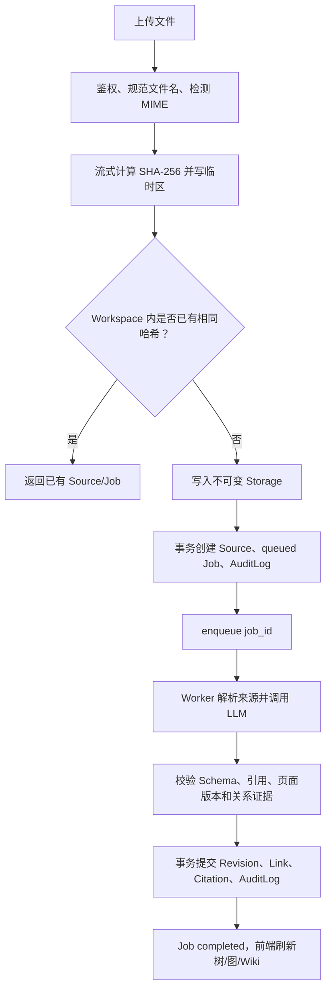
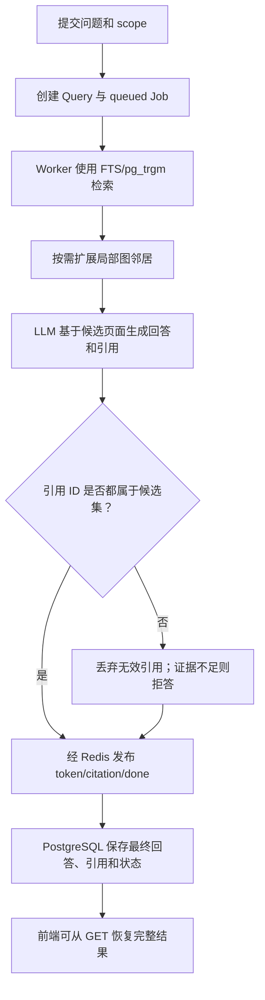
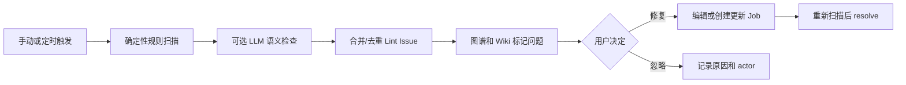
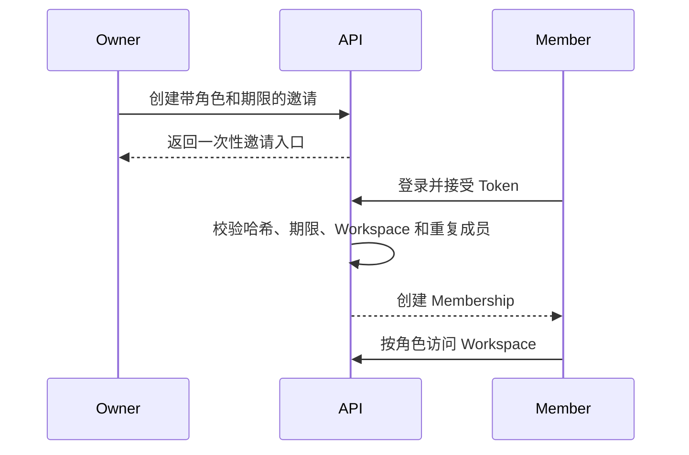
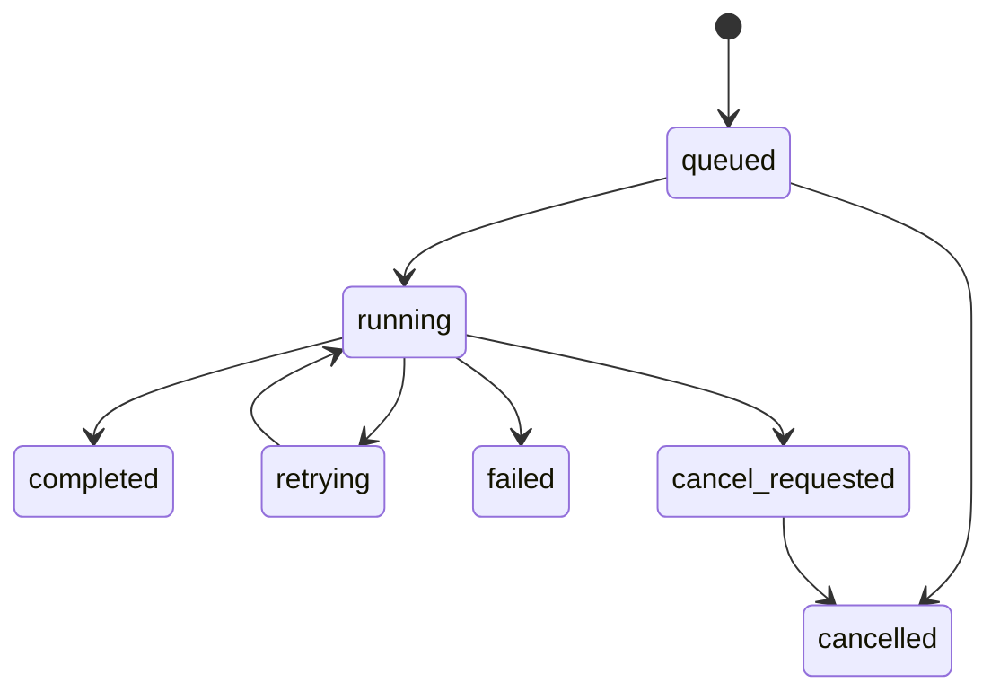

# 业务流程与状态设计

本文把分散在架构、接口和数据模型中的规则串成可执行流程。每条流程都明确入口、状态、成功输出、失败处理和闭环验证；字段细节以 [API 契约](api-contract.md) 和 [数据模型](data-model.md) 为准。

## 通用规则

- 每个写操作先完成身份与 `workspace_id` 授权；
- 长任务只由 Worker 执行，HTTP 请求创建任务后返回 `202`；
- PostgreSQL 保存用户可见的最终状态，Redis 只传递队列和实时事件；
- Worker 仅通过 `job_id` 读取上下文，不依赖 Web 请求中的全局用户；
- 所有模型输出先校验，再用短事务提交；
- SSE 可断线，最终结果必须能通过普通 GET 恢复；
- 每个重要动作写入 `audit_logs`，并关联 `request_id` 或 `job_id`。

## 1. Source 上传与 Ingest

### 前置条件

- 用户对 Workspace 具有 Editor 或 Owner 权限；MVP 0～2 使用默认用户；
- 文件类型、大小和配额通过校验；
- MVP 1 支持 UTF-8 Markdown/TXT，MVP 2 增加文本型 PDF。

### 主流程



Worker 内部遵循“先提取、再解析实体、最后提交”：

```text
生成/更新 Source Summary
→ 分批提取事实、实体、主题和 aliases
→ 用 title/slug/alias 查找重复候选
→ 合并候选并生成页面操作
→ 校验全部操作
→ 单事务提交
→ 刷新 Index/Activity 投影，必要时创建 Overview 更新
```

长文档的中间批次不对 Query 可见。批量上传时每个 Source 是独立 Job，Batch 只汇总排队、成功、跳过、失败和取消数量。

### 失败与恢复

| 失败点 | 行为 | 用户可见结果 |
| --- | --- | --- |
| 类型/大小/MIME 不合法 | 不创建 Source | 4xx + 稳定错误码 |
| Storage 写入失败 | 不创建 Job | 上传失败，可重新提交 |
| DB 已提交但 enqueue 失败 | Job 保持 `queued`，恢复扫描器重新入队 | 显示等待，不丢任务 |
| Parser/LLM/Schema 失败 | 最多 3 次总尝试，最终 `failed` | 保留 Raw 和安全错误摘要 |
| Revision 冲突 | 不写入任何 Wiki 变更，重新读取候选页面后重试 | 显示重试或人工复核 |
| Wiki 事务失败 | 整批回滚 | 不出现半页或半条关系 |

### 闭环验证

上传 `aurora-a.md` 后，Source 哈希与原文件一致，Job 完整经历状态变化，右侧能打开生成页面，图谱能定位相关节点，引用能回到 Raw；再次上传相同字节不会重复生成数据。

## 2. Query、引用与保存到 Wiki

### 主流程



查询范围固定为：

```text
current_page → 当前 Wiki
local_graph  → 当前页及 1～3 层显式邻居
workspace    → 当前 Workspace 全量检索
```

SSE 只改善实时体验。客户端断线重连时，先 GET 当前 Query 快照；未结束则重新订阅事件，已结束则直接渲染保存结果。

### 保存回答

```text
用户点击“保存到 Wiki”
→ 选择目标页面或创建新页面
→ 创建独立 update Job
→ LLM 返回结构化变更计划
→ 校验 expected_revision、引用和 Schema
→ 生成新 Revision
```

回答不会自动成为 Wiki 事实。若目标页面已变化，返回 `409 REVISION_CONFLICT`，用户重新预览差异后再次确认。

### 闭环验证

- 已知问题返回 `202`、流式答案和有效引用；
- 未知预算问题明确拒答；
- 伪造或跨 Workspace 引用无法出现在最终答案；
- 中断 SSE 后仍能通过 GET 获取最终回答；
- 保存回答只产生新的 Revision，不覆盖历史版本。

## 3. Lint 与问题处置



- 确定性检查优先：断链、孤立页、缺引用和无效引用；
- LLM 只建议语义冲突、缺失概念等 Issue，不直接修改 Wiki；
- 同一规则、页面和证据指纹只保留一个 open Issue；
- 修复后由重新扫描确认，不因点击按钮直接宣告解决。
- Schema 类问题只生成 Suggestion；展示 Diff 并由用户确认后，才创建新版本。

建议的维护顺序是：补 alias、处理重复页、修断链、连接孤立页、处理空页/缺引用、最后检查语义冲突。每一步都重新扫描，避免后续修复建立在过期结果上。

闭环验证：固定图谱必须发现一个 orphan 和一个 broken link；点击 Issue 能定位页面/节点；修复并重扫后状态变为 resolved，审计记录完整。

## 4. 人工编辑、版本与并发冲突

```text
打开 Page revision 7
→ 编辑并提交 expected_revision_no = 7
→ 服务端再次校验当前 revision
→ 相同：创建 revision 8 并刷新 links/citations
→ 不同：返回 409 和 current revision 元数据
→ 用户比较、合并并重新提交
```

恢复旧版本也创建一个新 Revision，不移动指针来改写历史。模型任务与人工编辑使用同一乐观并发规则，任何一方都不能静默覆盖另一方。

## 5. 多用户与团队协作

### 身份与空间隔离

```text
登录
→ 服务端 Session Cookie
→ 选择 Workspace
→ 每个 API/SSE/下载重新授权
→ 查询始终带 workspace_id
→ Worker 从 Job 记录读取 workspace_id
```

前端切换 Workspace 时必须取消旧订阅并清空文件树、图谱、问答和 Wiki 缓存；URL 中替换 ID 不能绕过后端授权。

### 邀请闭环



Owner 可管理成员；Editor 可摄取和编辑；Viewer 只可浏览和查询。邀请 Token 只保存哈希、可撤销且过期失效；最后一名 Owner 不可退出或被移除。

## 6. Obsidian 导出

```text
用户创建 Export Job
→ Worker 读取一个一致的 Wiki revision 快照
→ 生成 Frontmatter、[[wikilink]]、index.md 和 manifest
→ 计算导出文件哈希并写 Storage
→ 用户通过鉴权下载 ZIP
→ Obsidian 打开 Vault
```

导出是快照，不是在线权威数据。用户在 Obsidian 中修改文件不会自动回写；未来 Import 必须作为独立、可预览、可冲突检测的流程实现。

导出同时生成 `overview.md` 和由 AuditLog 投影的 `log.md`，并按页面类型组织 `sources/entities/concepts/analyses/questions`。在线系统不保存一份需要手工同步的导出副本。

## 7. Schema 建议与升级

```text
Lint 发现重复的页面结构或词表问题
→ 创建 Schema Suggestion
→ 展示规则、示例 Diff、受影响页面和风险
→ 默认用户或 Owner 接受/拒绝；Editor 可评审
→ 接受后创建 schema_version
→ 后续 Job 使用新版本
→ 旧页面只通过显式迁移更新
```

Schema 升级不与普通 Lint 修复混在同一事务中，且必须进入审计日志。

## 8. 任务取消、重试与故障恢复

### 状态机



- `max_attempts = 3` 表示首次执行加两次重试；
- 只对超时、临时网络错误和依赖短暂不可用自动重试；
- Schema 无效可在次数内使用纠错 Prompt；权限错误、文件不支持等永久错误不重试；
- running 取消是协作式的，Worker 在解析、模型调用结束和提交前检查；
- 一旦数据库提交开始，不强杀 Worker；提交完成后再将结果报告给用户；
- Worker 通过 heartbeat 标记存活，恢复扫描器处理长期无心跳任务；
- Redis 重启后，以 PostgreSQL 中 `queued/retrying` 为准重新入队；
- 幂等键和数据库唯一约束防止恢复过程重复提交。

## 9. MVP 交付流程

每个阶段使用同一交付循环：

```text
冻结阶段 Scope 和非目标
→ A/B/C/D 各建主 Issue，写清依赖与验收
→ 先合并数据/API/Mock 契约
→ 各角色在短分支并行实现
→ Unit/Integration/E2E
→ 四人按 docs/testing.md 执行 Gate
→ 记录性能、已知问题和决策
→ 打 Tag/Release
→ 才进入下一 MVP
```

任何 Gate 失败都回到对应 Issue 修复，不用“演示时手动绕过”代替闭环。详细阶段范围与负责人见 [路线图](roadmap.md)。

## 流程责任矩阵

| 流程 | 主责 | 必须协作 | 主要验证 |
| --- | --- | --- | --- |
| 上传/Storage | B | A、D | 哈希、去重、路径与权限 |
| Ingest/Wiki | C | B、D | Schema、事务、引用与图谱 |
| Query | C | B、D | 检索、拒答、引用与断线恢复 |
| Lint | C | B、D | 固定规则、Issue 联动与复扫 |
| Auth/隔离 | B | A、C、D | 跨租户矩阵 |
| 协作/版本 | B | C、D | RBAC、409 和审计 |
| 部署/恢复 | A | B、C、D | HTTPS、备份恢复和生产 E2E |

主责不等于单人完成；跨边界接口至少由另一角色 Review。
